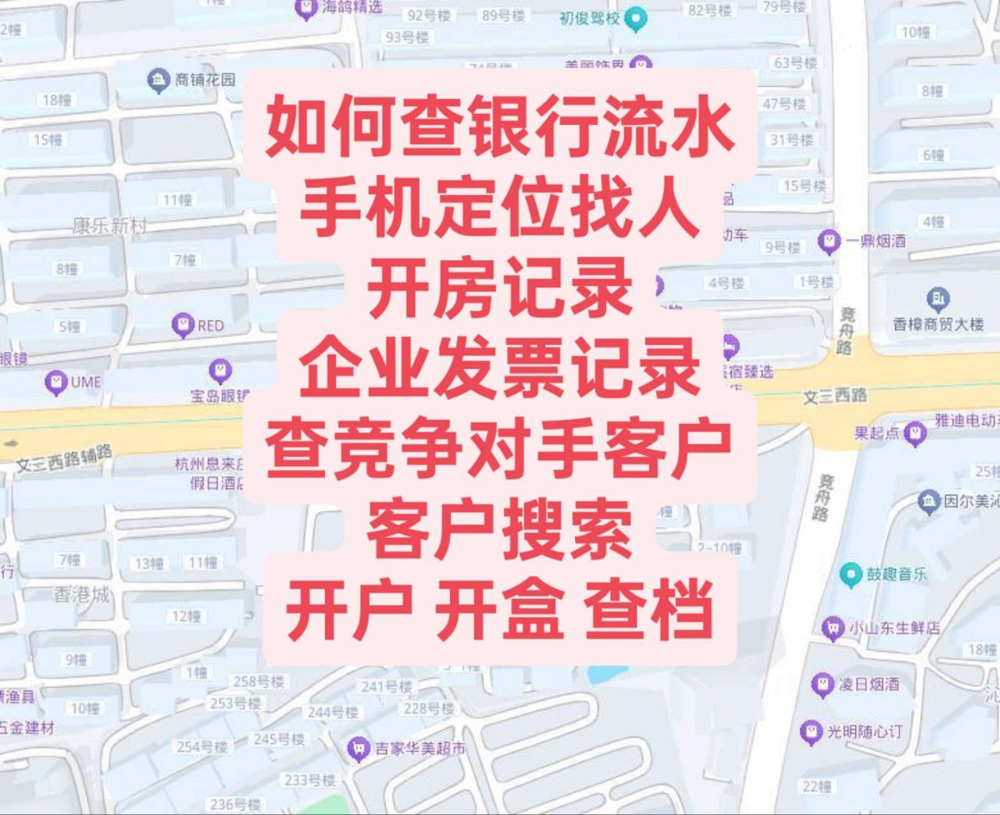

# 什么是查档, 开户, 开盒, 银行流水，开盒别人, 如何查微信聊天记录, 查开房记录

## **什么是开盒？[#](https://kaihe.xlog.app/guide?locale=zh#user-content-%E4%BB%80%E4%B9%88%E6%98%AF%E5%BC%80%E7%9B%92)**

“
开盒”（也被称为“人肉开盒”）是一个网络流行语，主要指通过非法或不正当手段，挖掘并公开某个人的**真实个人隐私信息**。

### “开盒”通常涉及哪些信息？

被“开盒”的信息通常包括但不限于：

- **真实姓名**和身份证号。
- **家庭住址**、公司或学校地址。
- **手机号码**、常用邮箱。
- **社交账号**（如微信、微博、QQ、贴吧等）的关联关系。
- 甚至是个人的**户籍照片**或银行卡信息。

